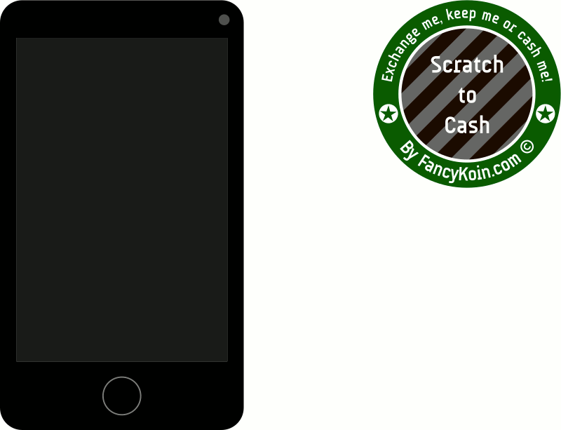

# Checkoin
Open standard to secure the circulation of physical cryptocoins.

[Physical cryptocoins](https://en.bitcoin.it/wiki/Physical_bitcoin) are mediums holding sealed [cold storage](https://en.bitcoin.it/wiki/Cold_storage) information for cashing cryptocurrencies (or more generally any redeemable asset). As Bitcoin addressed the digital currency's issue of double-spending, Checkoin aims to address the issues of the hand to hand circulation of physical cryptocoins (geolocation, counterfeiting, altering, copying, etc.), while protecting the freedom and anonymity of the users.

It allows to check the integrity of physical cryptocoins without having to break their sealing, with a high level of trust and ease, like checking a banknote under a UV blacklight. Thus, they can circulate safely, by hand from peer-to-peer, until they eventually get cashed by having their irreversible sealing opened, then trashed.

In other words, you don't need to “crack the nut” to know if it is “rotten”, you just perform a reliable “health evaluation” that helps you to decide if you accept it as a payment, if any doubt you simply reject it, [return it](#model__guarantee_duration), or crack it to be sure, and eat it!

Why physical coins in the digital age? Because it's fun, easy, socially interacting and pedagogical for bringing the use of cryptocurrencies to the masses. Furthermore, as the digital age is also the time of mass surveillance (gaining ground on our privacy under the [war on cash](https://www.corbettreport.com/the-war-on-cash-a-country-by-country-guide/)), and as the global fiat [currency war](https://en.wikipedia.org/wiki/Currency_war) has already started, having alternative means of exchange that rest most of their time off-the-grid in our pockets (and which worth more than the paper it's written on) is interesting way to stay away from these threats. Finally, Satoshi's motivation for Bitcoin wasn't the beauty or convenience of technology, but freedom, pursuing the dynamic to the physical world is more than ever bitcoinish.

In its current form Checkoin is a technical proposal for the standardization of such specifications, a pre-[RFC](https://en.wikipedia.org/wiki/Request_for_Comments)-like work in progress. You are welcome to [get in](#getting-in) in order to manifest this open economical ecosystem of trust, freedom, fluidity and innovation into reality!

## How it works
Additionally to the *Sealed Cashing Data* common to most physical cryptocoins, *Checkoin* *Coins* present a *Visible Scan Data* on their outer surface. When a user gets a *Coin* handed to him/her, the user *Scans* the *Visible Scan Data* of the *Coin* with a *Blacklight* application (or device) to check the *Coin*.

[](medias/scan.gif)

Then, the *Blacklight* retrieves information (via its server) from the *Network* about the *Coin*, and [cryptographically](#coin__encrypted_signature) authenticates it (using the *Visible Scan Data*'s *Passphrase* which is **never** sent anywhere outside of the *Blacklight*). If the authentication successes the *Blacklight*'s server performs data analysis about the *Coin* to be displayed on the *Blacklight*. Especially about the consistency of the geolocation and timing of the previous *Scans*' lineage. Indeed, if the *Coin* has been subjected to counterfeiting with its *Visible Scan Data* being copied, it means that there are multiple counterfeited “coins” that will be scanned at different locations and time, which will quickly become inconsistent with the frequency of exchanges and geographical distance between the *Blacklights*.

This verification imposes discouraging constraints to the wannabe counterfeiters. They would be able to counterfeit only a very very few copies of a *Coin* (not to say only one), while attempting to offload it quickly in a narrow geographical perimeter, in the hope of slipping through the net of the *Scans*' analysis by the *Blacklights*. As *Checkoin* allows anyone to become a *Minter*, the variety of *Coins*' shapes, colors, materials, holograms, etc. makes this counterfeiting very tedious (especially if the counterfeiter only captured the *Visible Scan Data* of the *Coin* but not the *Coin* itself, which pushes him/her to rush its handcrafted imitation, before the original moves to another location). That's also why *Blacklights* display [pictures](#model__illustrations) (and/or short videos) of the *Coin* provided by its *Minter*, so the user knows precisely how it is supposed to look like. The sophistication of the *Models* of *Coins* is recommended to be proportional to the value of the asset they hold, in order to make the difficulty to counterfeit proportionally dissuasive (from the simple cardboard up to the [key signing microchip](#coin__public_key)).

Here follows a non-exhaustive list of informations and services that the *Blacklights* should propose:

- analysis about the coherence of the geolocation and timing of previous *Scans*,
- content of the [address](#coin__asset_pointer) associated with the *Sealed Cashing Data* on the cryptocurrency's blockchain,
- [picture](#model__illustrations) and other informations about of the *Coin* provided by the *Minter*,
- instant market value of the asset held by the *Coin* and of the *Coin* itself (as well as trends, how to resell it, etc.),
- how to perform eventual [extra security checks](#model__check_info) (e.g. for *Coins* with holograms, watermarks, UV ink, [key signing microchips](#coin__public_key), etc.),
- USB cryptographic check for *Coins* holding a [key signing microchip](#coin__public_key),
- is the *Coin* [guaranteed](#model__guarantee_duration),
- analysis of the informations of reliability provided by the *Auditors* about the *Coin*, the *Model*, the *Minter*, etc.,
- general good practice advises for the end user (e.g. which questions should I ask to the person who hands me the *Coin* based on the analysis),
- should I accept, [return](#model__guarantee_duration), cash or reject the *Coin* based on the analysis,
- how to contact an *Auditor* if I noticed something suspicious,
- a button “alert me when this *Coin* is scanned again”,
- etc.

Then, unless the user has requested an “silent scan”, a new *Scan* record of the current location and time gets stored on the *Network* (optionally encrypted), which brings the process to a close, until the next *Scan*. Thus, scanning a *Coin* enforces the safety of its circulation.

### Notes
- Even if the “user” is alluded to in this document for practical reasons, there is no such thing as a “user” in the definitions nor data model of these specifications, for obvious privacy reasons. The only identified endpoint of *Checkoin* for the “end user” is the well established *Blacklight* server manager's *Account*. Any *Checkoin* component is forbidden to require (coercively or not) any “end user” to identify with an *Account* under any circumstance.
- The *Sealed Cashing Data* is not limited to cryptocurrencies, there is no reason for such limitation, and it facilitate the diversification of assets in peoples' pockets/portfolios which enforces economical security, other *Asset Types* could be:
    - a [BitGold](https://www.bitgold.com/) coupon,
    - Air Miles,
    - a stock of vintage wine or [parmesan](https://www.rt.com/business/331290-parmesan-italy-bank-bonds/) listed on a stock exchange,
    - a coupon for the local grocery store (then the *Blacklight* should display the value of the asset according to the location, it is likely to value 0 half way around the world)
    - etc.
- If the *Visible Scan Data* of a *Coin* gets leaked on the Internet, or if a previous user kept note of it, there is the possibility of an attack on this *Coin*'s integrity by making multiple forged scans with inconsistent time and location. This is unlikely to happen except for gratuitous malice or retaliation (e.g. an angry customer), but if the *Coin* integrity gets damaged, it still has the value of the asset it holds, so, the damage is limited. Such an attack would be like smashing a Philharmonic gold coin with a hammer, it loose some of its value, but it's still gold. Furthermore, such attacks could be intercepted by the *Blacklights*' servers with some pattern analysis.
- The circulation of *Coins* passed from hand to hand can speed up the transaction process and relieve the traffic congestion on saturated cryptocurrencies like Bitcoin.
- Checkoin is more resilient against Internet failure/censorship than cryptocurrencies. Indeed, it doesn't require worldwide write access to allow exchanges to take place, the only writing that happens during an exchange is the *Scan*, which is by design optional (“silent scan”) and can be replicated on the *Network* later on when Internet is restored (via the second *Pool* layer). In case of Internet failure/censorship any database backup of the *Checkoin* *Network* (including [media ressources](#model__illustrations)) can operate in a local standalone mode (or within a regional [LAN](https://en.wikipedia.org/wiki/Local_area_network)), with a reasonable middle term reliability (but it will eventually suffer a lack of remote *Scan* data at some point and ignore *Coins* minted after the connexion loss).
- There will always be counterfeiters, but *Checkoin* makes it quite dissuasive and unworthy. Also, one of the reasons why counterfeiting has been so tempting in history of mankind is the monopoly on money supply, and artificial scarcity typical to economies of perpetual crisis. But with *Checkoin* there is no such monopoly, it's an economy of abundance, anyone able to manufacture fake “coins” can more easily become a legit *Minter*, which might also reduce this temptation.

## Definitions

### Network
The decentralized computer logistics that runs the software and data that are common to all *Checkoin* actors and accessible from the Internet. The Network is composed of two layers based on existing technologies, the lower layer called the *Chain* and the upper layer the *Pool*.

#### Chain
A set of applications and data running upon an existing blockchain technology able to execute smart contracts (likely to be Ethereum). It hosts the rigid, neutral, unstoppable, secure and minimal components of the *Checkoin* clockwork. Where interaction between untrusted *Accounts* must remain safe, and where eternal and indisputable data that worth paying transaction fees for gets stored.

#### Account
A native account on the blockchain technology that runs the *Chain*.

Additionally, an Account can store extra information about itself on the *Chain*.

Example of an Account information record:


```json
{
// Mandatory
 "checkoin_version": "pre-RFC_VERSION",
 "account": "0x9876[…]54321",
 "name": "Etsy Minter Artist",

// Free
[…]
 "email": "mintart@gmail.com",
 "url": "https://www.etsy.com/shop/mintart/",
[…]
}
```

Mandatory fields:

- ```checkoin_version```: the version of the *Checkoin* specifications followed to create the Account,
- ```account```: the Account address,
- ```name```: the name of the Account.

Any other field can be freely added, please [contribute](#crowdsourcing) to help improving and standardizing them.

#### Pool
A network layer for storing, retrieving and broadcasting public signed data that do not need or cannot be stored on the *Chain*. Typically because this data is frequent, large, do not require blockchain validation, or requires real time propagation.

In its first version this layer implementation follows the [KISS principle](https://en.wikipedia.org/wiki/KISS_principle), it is currently the most debatable technical part, you are welcome to [contribute](#crowdsourcing) to propose improvements.

It simply consists in a collection of *Seed Nodes* registered on the *Chain*, that make their data available via asynchronous replication able technology (undetermined yet, might be something like CouchDB, Redis, etc.).

Self-explanatory example of a *Seed Node* record:

```json
{
 "checkoin_version": "pre-RFC_VERSION",
 "uuid": "55555555-555555555-5555-555555555555",
 "owner": "0x1234[…]56789",
 "method": "couchdb",
 "address": "http://seed.koinscan.com:5984/_replicate",
 "data_type": "scans",
 "date": "2016-03-23T11:11:00+11:11",
 "active": true
}
```

If the asynchronous replication menaces to saturate, a second version of *Checkoin* might relegate its role for the initial synchronization of *Slave Nodes*, then new incoming data being globally transported via another P2P broadcast mesh network. Or this whole layer could be moved to a better suited or tailor made technology.

This data is likely to be curated before being exploited, by selecting the *Seed Nodes* and the signed data they serve based on their [reputation](#auditor).

*Seed Nodes* should primarily be set up and managed by *Blacklight* fabricators for their own use, but not necessarily, it could also be collaborative or third party services.

### Localized String

A dictionary object presenting multiple translations of the same string.

Self-explanatory example of a Localized String:

```json
{
 "en_GB": "Open standard to secure the circulation of physical cryptocoins.",
 "fr": "Standard ouvert pour sécuriser la cirulation de crypto-pièces physiques.",
[…]
}
```

### Auditor
Outside of the merciless *Chain* technology, we face again the classic trust issues of the physical world. While *Checkoin* core is designed not to suffer from it (when trust gets broken the way out is to reject, [return](#model__guarantee_duration) or cash the *Coin*), having a [reputation system](https://www.youtube.com/watch?v=Yn7e0J9m6rE) on top of it can significantly enhance the level of trust, which will greatly extend the area of proper functioning of the service and smoothen its use.

To do so, any *Account* can become an Auditor by providing extra *Audit* information about the ecosystem. Whether they are ad-hoc or professional Auditors.

#### Audit
A record on the *Network* providing information about the reliability an of an entry:

- *Pool*'s *Seed Nodes*,
- *Asset Types*,
- *Blacklights*,
- *Blacklights*' *Versions*,
- *Models*,
- *Coins*,
- *Scans*,
- *Accounts*:
    - *Minters*,
    - *Blacklight* fabricators,
    - *Blacklight* *[Server Managers](#scan__blacklight_server)*,
    - *[Asset Producers](#model__asset_producer)*,
    - *[Asset Suppliers](#model__asset_supplier)*,
    - *[Asset Managers](#model__asset_manager)*,
    - *[Asset Vaults](#model__asset_vault)*,
    - other *Auditors*,
    - etc.
- other *Audits*.

Example of an Audit record:

```json
{
// Mandatory
 "checkoin_version": "pre-RFC_VERSION",
 "uuid": "99999999-888888888-7777-666666666666",
 "auditor": "0x9876[…]54321",
 "entry_uuid": "11111111-222222222-3333-444444444444",
 "entry_reliability": 0.98,
 "audit_depth": 0.42,
 "audit_method": "videoconferencing",
 "audit_domain": "privacy",
 "date": "2016-03-23T11:11:00+11:11",
 "signature": "0x1111[…]22222",

// Free
[…]
}
```

Mandatory fields:

- ```checkoin_version```: the version of the *Checkoin* specifications followed to create the Audit,
- ```uuid```: the [UUID](https://en.wikipedia.org/wiki/Universally_unique_identifier) of the Audit,
- ```auditor```: the *Auditor*'s *Account* address,
- ```entry_uuid```: the [UUID](https://en.wikipedia.org/wiki/Universally_unique_identifier) of the audited entry,
- ```entry_reliability```: a decimal number representing the reliability of the entry, from 0 (lower) to 1 (higher),
- ```audit_depth```: a decimal number representing the depth of the entry, from 0 (shallow) to 1 (deepest),
- ```audit_method```: a slug describing the audit method (e.g. "user_feedback", "videoconferencing", "postal\_way", "on\_premises", etc.),
- ```audit_domain```: a slug describing the domain in which domain the audit has been carried out (e.g. "privacy", "checkoin\_specs\_compliance", "data\_protection", "ecology", "neutrality", "independence", "customer\_service", etc.),
- ```date```: ISO 8601 timestamp of the date of the Audit,
- ```signature```: *Auditor*'s signature of all the other fields (mandatory and free) alphabetically ordered and serialized in a non-indented JSON string, so it can be trusted outside of the *Chain* (e.g. if replicated on the *Pool*).

Any other field can be freely added (**except for Audits on Scan records** for privacy reasons), please [contribute](#crowdsourcing) to help improving and standardizing them.

*Checkoin* do not provide nor recommend any method for analyzing this data, it's up to the *Blacklight* fabricators and *Auditors* to innovate on this domain. However, *Checkoin* might provide some toolkits and libraries [in the future](#roadmap) that may include some standard Audit analysis algorithms.

An Audit can be registered on the *Chain* or on the *Pool*, however an Audit registered on the *Chain* might have more weight, as well as an Audit that is more recent.

### Asset Type
A record on the *Chain* describing a type of redeemable asset.

Self-explanatory example of an Asset Type record:

```json
{
// Mandatory
 "checkoin_version": "pre-RFC_VERSION",
 "uuid": "10101010-101010101-0101-010101010101",
 "registered_by": "0x0707[…]07070",
 "name": "Bitcoin",
 "slug": "BTC",
 "symbol": "Ƀ",

// Optional
 "description": "World's most famous cryptocurrency.", // Or a  Localized String.

// Free
[…]
}
```

### Minter
An entity that manufactures *Coins*, identified with an *Account*.

### Model
The base model for a series of *Coins*, registered on the *Chain*.

Example of a Model record:

```json
{
// Mandatory
 "checkoin_version": "pre-RFC_VERSION",
 "uuid": "12345678-901234567-8901-234567890123",
 "minter": "0x3333[…]44444",
 "name": "0.05Ƀ Limited Red Watermark",
 "asset_type": "10101010-101010101-0101-010101010101",
 "quantity": 0.05,
 "cashing_method": "armory",
 "date": "2016-03-23",
 "illustrations": [
    {
     "mime": "image/jpeg",
     "type": "heads",
     "url": "http://secoin.io/pics/005BTC_lrw_heads.jpg",
    },
    {
     "mime": "image/jpeg",
     "type": "tails",
     "url": "http://secoin.io/pics/005BTC_lrw_tails.jpg",
    },
    {
     "mime": "video/mp4",
     "pool_uuid": "77777777-777777777-7777-777777777777",
    },
 ],

// Optional
 "check_info": {
     "en_GB": "Look the watermark through a light.",
     "fr_FR": "Regarder le filigrane à travers la lumière."
 },
 "description": "Coin holding 0.05Ƀ, limited edition with a red watermark.",
 "limited": 5000,
 "max_scans": 1000,
 "guarantee_duration": 365,
 "url": "http://secoin.io/models/005BTC_limited_red_watermark/",
 "asset_producer": "0x2211[…]22112",
 "asset_supplier": "0x3344[…]33443",
 "asset_manager": "0x5566[…]55665",
 "asset_vault": "0x7788[…]77887",
// Free
[…]
}
```

Mandatory fields:

- ```checkoin_version```: the version of the *Checkoin* specifications followed to create the Model,
- ```uuid```: the [UUID](https://en.wikipedia.org/wiki/Universally_unique_identifier) of the Model,
- ```minter```: the *Minter*'s *Account* address,
- ```name```: the name of the Model,
- ```asset_type```: the [UUID](https://en.wikipedia.org/wiki/Universally_unique_identifier) of the *Asset Type* held by each *Coin* of this Model,
- ```quantity```: decimal number representing the quantity of *Asset Type* held by each *Coin* of this Model, this field can be overridden by the same [```quantity```](#coin__quantity) field of the *Coin* if present,
- ```cashing_method```: a slug representing the method to be used to cash *Coins* of this Model (e.g. "armory", "pub\_priv\_keys", "bitgold\_coupon", etc.),
- ```date```: ISO 8601 timestamp of the date of the Model,
- ```illustrations```: a list of media resource(s) that illustrate this Model of *Coin*, media resource fields are:
    - ```mime```: the mime type of the media (mandatory),
    - ```url``` or ```pool_uuid```: to retrieve the media (mandatory),
    - ```type```: a slug indicating what the media stands for (optional).

Optional fields:

- ```check_info```: a string or a *Localized String* providing information on how to check *Coins* of this Model if it provides extra security (e.g. for holograms, watermarks, UV ink, [key signing microchips](#coin__public_key), etc.),
- ```description```: a string or a *Localized String* describing this Model of *Coin*,
- ```limited```: the number of minted *Coins* of this Model, if limited,
- ```max_scans```: an integer indicating the maximum number of *Scans* recommended by the *Minter* for *Coins* of this Model, if any (e.g. for Models of *Coins* made of degradable materials that might become unusable after too many exchanges),
- ```guarantee_duration```: integer defining duration of the guarantee in days, if any (or -1 for unlimited guarantee), starting from the [```date```](#coin__date) of each *Coin* of this Model, in such case any of these *Coins* having their integrity compromised can be returned (or “cashed” online) for a new *Coin* instead of their redeemable asset,
- ```url```: the URL of the website or page dedicated to this Model of *Coin*,
- ```asset_producer```: the *Account* address of the entity that is producing the asset,
- ```asset_supplier```: the *Account* address of the entity that is supplying the asset,
- ```asset_manager```:  the *Account* address of the entity that is managing the asset,
- ```asset_vault```: the *Account* address of the entity that is safekeeping the asset,


Any other field can be freely added, please [contribute](#crowdsourcing) to help improving and standardizing them.

Optionally, Model records can be made private by having all their fields (except ```checkoin_version``` and ```uuid```) serialized into a JSON string encrypted with the first half of the *Coins*' *Visible Scan Data*'s *Passphrases* (this first half prefix must be the same for all the *Passphrases* of all the *Coins* of this Model in this case, if the length of a *Passphrase* is odd the first half is the longest), then nested into the ```encrypted``` field. However, this encryption might slow down the *Scan* process as the *Blacklight* will have to decrypt it for the *Blacklight*'s server.

Example of the same record made private:

```json
{
 "checkoin_version": "pre-RFC_VERSION",
 "uuid": "12345678-901234567-8901-234567890123",
 "encrypted": "ggZMZngTm0XZMO+RMwm2UY7OCP+yjohaMwt1 […] zqsOIryyuq0czymOFPtjMh+DB/c5A="
}
```

### Coin
A medium presenting a single *Visible Scan Data*, a single description of the asset it holds (e.g. “0.01Ƀ”), the mention “Exchange me, keep me, or cash me!”, and holding a single *Sealed Cashing Data*, Typically a flat cardboard or plastic object (but it can be anything, it's up to the innovation of the *Minters*).

Each minted Coin comes with a record registered on the *Chain*.

Example of a Coin record:

```json
{
// Mandatory
 "checkoin_version": "pre-RFC_VERSION",
 "uuid": "33333333-444444444-4444-333333333333",
 "model": "12345678-901234567-8901-234567890123",
 "date": "2016-03-23T11:11:00+11:11",
 "asset_pointer": "1P89rsq6HxAPSi3CAaFEEagdqWbe2T6imc",
 "preloaded": false,
 "encrypted_signature": "GfAlfjuWnPeAhBy+cn3/bAddbzJU8e2AR0U126VFD3g=",

// Optional
 "quantity": 0.01,
 "expiry_date": "2018-03-14T04:53:32",
 "returnable": true,
 "public_key": "0x2222[…]11011",

// Free
[…]
}
```

Mandatory fields:

- ```checkoin_version```: the version of the *Checkoin* specifications followed to mint the Coin,
- ```uuid```: the [UUID](https://en.wikipedia.org/wiki/Universally_unique_identifier) of the Coin,
- ```model```: the [UUID](https://en.wikipedia.org/wiki/Universally_unique_identifier) of the *Model* of the Coin,
- ```date```: ISO 8601 timestamp of the minting of the Coin,
- ```asset_pointer```: a string indicating where the asset is located (typically a cryptocurrency address),
- ```preloaded```: boolean indicating if the Coin was provided by the *Minter* with the asset present at the ```asset_pointer``` (e.g. “US government” “forbids” to sell preloaded cryptocoins, it has to be loaded later on by the user),
- ```encrypted_signature```: *Minter*'s signature of all the other fields (mandatory, optional and free) alphabetically ordered and serialized in a non-indented JSON string, then encrypted with the *Visible Scan Data*'s *Passphrase* of the Coin. So the holder of the Coin can prove he/she is physically holding it by making the *Blacklight* decoding the signature and make it match by the *Blacklight*'s server.

Optional fields:

- ```quantity```: decimal number representing the quantity of *Asset Type* held by the Coin, if present it overrides the *Model*'s ```quantity``` field,
- ```expiry_date```: ISO 8601 timestamp recommended by the *Minter* to cash the Coin, whether it be because of the physical lifetime of the Coin or of the asset,
- ```returnable```: boolean indicating if the *Coin* can be returned/refunded to the *Minter* after being cashed (for *Coins* which are not physically destroyed after having their sealing opened, e.g. for read-once self-erasing microchip),
- ```public_key```: the public key of the Coin, in case it carries a key signing microchip holding the corresponding private key (e.g. flat printed circuit USB pins), the user plugs the Coin to the *Blacklight* which sends it a random message to be signed, and finally checks the resulting signature against the public key for authentication.

The communication protocol between the *Blacklight* and the microchip (for key signing and read-once self-erasing) isn't covered by these specifications, but it is likely to become a separated document.

Any other field can be freely added, please [contribute](#crowdsourcing) to help improving and standardizing them.

Optionally, a Coin record can be made private by having all its fields (except ```checkoin_version```, ```uuid``` and ```encrypted_signature```) serialized into a JSON string encrypted with the *Visible Scan Data*'s *Passphrase* of the Coin, then nested into the ```encrypted``` field. However it might slow down the *Scan* process as the *Blacklight* will have to decrypt it for the *Blacklight*'s server.

Example of the same record made private:

```json
{
 "checkoin_version": "pre-RFC_VERSION",
 "uuid": "33333333-444444444-4444-333333333333",
 "encrypted": "gkcsSuW/7LBTkuCDgWhzaqG […] zp0mTW2oToB64alxc+YW2gR38b/sY=",
 "encrypted_signature": "GfAlfjuWnPeAhBy+cn3/bAddbzJU8e2AR0U126VFD3g=",
}
```

#### Visible Scan Data
An UUID with a unique dedicated Passphrase (of unspecified length), typically a QR Code visible on the outer surface of the object, preferably not requiring manual intervention to be unveiled it in order to facilitate mass scanning, along with the mention “Scan me with a Checkoin(.Org) Blacklight App”.

The data can be presented in two formats:

- the 128 bits UUID immediately followed by the Passphrase,
- encapsulated and encoded in a URL:

```
http(s)://checkoin.org/ckn/UUID#PASSPHRASE
```

For security reasons the *Blacklights* that will *Scan* the data has to be third party components, this is a key element in *Checkoin*'s security design. However, in case the user has no knowledge of *Checkoin*, the Visible Scan Data should point out a neutral and safe location to download such a *Blacklight* App. To do so, and in order to reduce the [single point of failure](https://en.wikipedia.org/wiki/Single_point_of_failure) risk, the Visible Scan Data can propose multiple entry points for acquiring a *Blacklight*:

- via the mention “Scan me with a Checkoin Blacklight App”, so the user is likely to search for a *Blacklight* App via a search engine or his/her smartphone's application store,

or

- via the mention “Scan me with a Checkoin.Org Blacklight App”, so the user is likely to visit [checkoin.org](http://checkoin.org) to learn about Checkoin and find the list of [highlighted](#your-checkoin-service-or-product-highlighted) *Blacklights*, or search for a *Blacklight* App via a search engine or his/her smartphone's application store,

and/or

- by presenting the data in the URL format, so any QR Code reader will open the dedicated landing page on [checkoin.org](http://checkoin.org) that may present some very basic information about the *Coin*, *Checkoin* itself, and for sure list the [highlighted](#crowdfunding)' *Blacklights* proposed for install. Once installed, the *Blacklight* App should intercept URLs that match the ```//checkoin.org/ckn/``` pattern instead of letting it being opened by the default application.

#### Sealed Cashing Data
Data allowing its holder to retrieve an asset in his/her possession without any other condition than being the first to claim it (typically the QR Code of an Armory cold storage wallet, offline wallet passphrase, the public+private key of a wallet, etc., but not limited to cryptocurrencies, it can give access to any redeemable asset). The data must be hidden by an irreversible seal which when opened shows obvious evidence of tampering to the naked eye (e.g. wax seal, thick scratch-card, etc.), or to the *Blacklight* “eye” (e.g. read-once self-erasing microchip).

For security reasons the *Minter* should not store this data, but might want to keep a hash of it associated to the *Coin*'s ```uuid``` (e.g. to authenticate a compromised [guaranteed](#model__guarantee_duration) *Coin* to be replaced).

### Blacklight
A device (or smartphone application, etc.) able to perform a *Scan* of the *Visible Scan Data* of a *Coin*, exchange information about it with the *Network* (through its dedicated server), make verifications, and, if the *Visible Scan Data* is legit, display human readable information about the *Coin*'s health.

A Blacklight might also be able to scan multiple *Coins* at once to provide a quick general estimation of a handful of *Coins* (e.g. for cash registers Blacklights).

The Blacklight **mustn't ever send** the *Visible Scan Data*'s *Passphrase* anywhere, if any encrypting or decrypting needs to be performed by the *Blacklight*'s server (or any third device, software, entity, etc.), the information to be encrypted or decrypted must be sent to the Blacklight for it to perform the process and send back the result to the server. Any decrypted information sent by the *Blacklight* mustn't be stored anywhere at anytime, and must have been erased from any cache memory once the *Scan* process has ended on the user side.

The communication protocol between the *Blacklights* and their servers isn't covered by these specifications, but it is likely to become a separated open and standardized REST API. The *Blacklights* are likely to communicate by default with servers owned and managed by their fabricators (for obvious technical an business model reasons), but they should be able to communicate with any server in an interoperable manner (while allowing some extra features to be server-specific), as a alternative or rescue option (e.g. partial Internet failure/censorship).

*Blacklights* applications and devices also have a corresponding record on the *Chain*.

Self-explanatory example of a *Blacklight* record:

```json
{
// Mandatory
 "checkoin_version": "pre-RFC_VERSION",
 "uuid": "19371937-193719371-9371-937193719371",
 "fabricator": "0x1234[…]56789",
 "type": "software",
 "platform": "android",
 "website": "http://koinscan.com/app/",
 "date": "2016-03-23T11:11:00+11:11",

// Free
[…]
}
```

*Blacklights* are identified by their versions, in order to facilitate their *Audits*.

Self-explanatory example of a *Blacklight* *Version* record:

```json
{
// Mandatory
 "checkoin_version": "pre-RFC_VERSION",
 "uuid": "48624862-486248624-8624-862486248624",
 "blacklight": "19371937-193719371-9371-937193719371",
 "version": "0.8b",
 "date": "2016-03-23T11:11:00+11:11",

// Free
[…]
}
```

#### Scan
A Scan is the scanning process performed by the *Blacklight*, and, unless the user explicitly asks for a “silent scan”, it also becomes a record on the *Pool* about the time and location of the *Blacklight* during the Scan (optionally encrypted). A “silent scan” doesn't mean that the geolocation information isn't sent to the *Blacklight* server for consistency analysis, it means that it is not recorded, however, in such case of “silent scan”, the *Blacklight* **must** ask the user if he/she agrees to have this data sent outside of the *Blacklight*.

The default action is to make such a record, but in some cases the *Blacklight* can suggest the user to perform a “silent scan” (e.g. if the location is based on the IP address of the *Blacklight* and there is a geographical incoherence the *Blacklight* may ask “We detected a geographical mismatch. Are you using a VPN? If yes, you might want to perform a “silent scan” not to provide inconsistent information that can damage the integrity of the coin.”).

Example of a Scan record:

```json
{
// Mandatory
 "checkoin_version": "pre-RFC_VERSION",
 "uuid": "13713713-137137137-1371-371371371371",
 "coin": "33333333-444444444-4444-333333333333",
 "blacklight": "48624862-486248624-8624-862486248624",
 "blacklight_server": "0x8888[…]88888",
 "location": "43.6023,1.4444",
 "location_method": "ipv4",
 "location_precision": 2000,
 "date": "2016-03-23T11:11:00+11:11",
 "signature": "0x2121[…]21212"
}
```

Mandatory fields:

- ```checkoin_version```: the version of the *Checkoin* specifications followed to mint the Scan,
- ```uuid```: the [UUID](https://en.wikipedia.org/wiki/Universally_unique_identifier) of the Scan,
- ```coin```: the [UUID](https://en.wikipedia.org/wiki/Universally_unique_identifier) of the *Coin*,
- ```blacklight```: the [UUID](https://en.wikipedia.org/wiki/Universally_unique_identifier) of the *Blacklight* *Version*,
- ```blacklight_server```: the  *Account* address of the *Blacklight* server's manager,
- ```location```: a comma separated string of the two coordinates representing the geolocation of the *Blacklight* when the Scan has been performed, as decimal degrees with negative numbers for South and West,
- ```location_method```: a slug defining the method used for geolocalizing the *Blacklight* when the Scan has been performed (e.g. "gps", "ipv4", "ipv6", "zipcode", "manual", "fixed\_blacklight", etc.),
- ```location_precision```: integer defining the precision of the location in meters, -1 if unknown,
- ```date```:  ISO 8601 timestamp of when Scan has been performed,
- ```signature```: *Blacklight* server manager's signature of all the other fields alphabetically ordered and serialized in a non-indented JSON string, so it can be trusted by being replicated on the *Pool*).

For privacy reasons there is no free fields for this type of record.

Upon user's request the fields ```location```, ```location_method``` and ```date``` can be serialized into a JSON string encrypted with the *Visible Scan Data*'s *Passphrase* of the *Coin*, and nested into the ```encrypted``` field. It allows to greatly reduce the possibility of tracking of the Scan by monitoring the *Network*, made virtually impossible to anyone not physically possessing the *Coin* (except if previous user(s) made a copy of the *Passphrase* or leaked it). However this process may slow down the scan process as it involves more back and forth encrypting and decrypting communications between the *Blacklight* and the *Blacklight*'s server.

Example of the same record partially encrypted:

```json
{
// Mandatory
 "checkoin_version": "pre-RFC_VERSION",
 "uuid": "13713713-137137137-1371-371371371371",
 "coin": "33333333-444444444-4444-333333333333",
 "blacklight": "0x8888[…]88888",
 "encrypted": "9H/GQT0Ut4+zGTKVldc9AgXH8LRii7rOgYpG0Csf8W6oKBrZNndDmLNbay5gevDQeB
aZf5mSWxEH3I5H7lQNn6TmO9GEi7+/eAZkCbh/t91Haya9/X5DXO",
 "signature": "0x2121[…]21212"
}
```

### Checkoin
Checkoin may refer to [checkoin.org](http://checkoin.org/), the technology, its specifications and its instantiation, as well as the future non-profit and neutral entity representing Checkoin and its community. This entity will be conceived and set up after a period of observation of the *Checkoin* ecosystem, and is likely to operate by its own rules upon smart contracts. Until then, this entity is its founder's natural person, Camille Harang. For the time being Checkoin is a codename, it might change – or not – by the time the first official specifications are being released.

## Getting in
Want to join the adventure? Great! Here are leads to [crowdsource](#crowdsourcing) and [crowdfund](#crowdfunding) *Checkoin*. If you have other ideas on how to participate, please propose it by [contributing](#crowdsourcing).

### Crowdsourcing
If you wish to contribute to *Checkoin*, you are welcome to do so by using the [GitHub](https://github.com/mammique/checkoin/) tools, whether it be for technical improvements, remarks, questions, technology scouting, suggestions, or anything else. Please verify that there is no [issue](https://github.com/mammique/checkoin/issues) covering the topic you wish to introduce beforehand, otherwise feel free to [open one](https://github.com/mammique/checkoin/issues/new). Once the topic has been discussed and decided you can fork the [raw version](https://github.com/mammique/checkoin/blob/master/README.md) of this document and make a [pull request](https://github.com/mammique/checkoin/pulls). Don't forget to append you name to the [authors](#authors) list if it's your first contribution.

Each [raw version](https://github.com/mammique/checkoin/blob/master/README.md) of this document (not the fair use illustrations of the [checkoin.org](http://checkoin.org) website) is published under the [Creative Commons BY-ND](http://creativecommons.org/licenses/by-nd/4.0/) license in order to provide consistency and avoid confusion for each new version. But you are of course allowed to fork it to propose improvements to *Checkoin*, also, by doing so, you allow *Checkoin* to modify and republish your modifications under the same [Creative Commons BY-ND](http://creativecommons.org/licenses/by-nd/4.0/) license.

### Crowdfunding
*Checkoin* is an ambitious industrial project, it will require an adequate funding to match the required standards to manifest it into reality. To do so, you are invited to make donations to fuel the continuous “rolling crowdfunding”, meaning that the development [roadmap](#roadmap) goes on as the funding comes in.

If you wish to receive [reward(s)](#rewards) while donating via “anonymous” cryptocurrencies, please [register your donation](https://checkoin.org/donations/register/) **before** making the transaction.

Donation methods:

- **Bitcoin**:  1P89rsq6HxAPSi3CAaFEEagdqWbe2T6imc
- **Ether**: 0x1b526A1c151a5803597a8bc04cd1230a5bF2CB38
- **BitGold**: mammique@garbure.org (preferably Singapore or Zurich vaults if possible)

#### Rewards

If you are donating via “anonymous” cryptocurrencies, please [register your donation](https://checkoin.org/donations/register/) **before** making the transaction.

The rewards will be distributed accordingly to the amount of the donation (that can be cumulated with other donations later on), with an advantage for the early donors (based on a timing ratio factor to be determined).

[Contributors](#crowdsourcing) will also be eligible for rewards, but remember that one's work estimation is very subjective, depending on the time invested, experience, skills, ego, efficiency, aspirations, rivalry, etc. *Checkoin* will make efforts to be as fair and grateful as possible on this, but a disclaimer is required: if you have high expectations on rewards and are easily disappointed, you might want to go for a donation instead.

The rewards will be defined and adjusted in an empirical manner. I (Camille Harang, founder) had the idea of *Checkoin* after discovering the [Satori Coin](https://twitter.com/mammique/status/708265686670450689), I first started to conceive innovative physical cryptocoins, before realizing that a technology like *Checkoin* needed to be implemented beforehand to allow these *Coins* to circulate safely. After having dedicated myself to this task, I reserve the right to be eligible to reward(s), whether I want to dive into the minting adventure, or not… That's why I came up with the idea of the “[highlight service or product](#your-checkoin-service-or-product-highlighted)” reward, in case I still feel like proposing *Checkoin* service(s) in the future. But that's a very subjective idea, maybe you'd like something else that I didn't think about? That's why you are invited to [choose](#you-choose) your reward!

##### → You choose!
Please [contribute](#crowdsourcing) to propose reward(s) you would like to receive. It can be anything as long as it doesn't threat to jeopardize or alter the project (e.g. technological security or privacy disruptions, unclear conflict of interest, etc.),

##### → Your Checkoin service or product highlighted
The website [checkoin.org](https://checkoin.org/) will list upon request any service or product related to *Checkoin* (*Blacklights*, *Models*, *Minters*, *Auditors*, market places for *Coins*, [Asset Producers](#model__asset_producer), [Asset Suppliers](#model__asset_supplier), [Asset Managers](#model__asset_manager), [Asset Vaults](#model__asset_vault), etc.), but the donors' products and services will be highlighted on the top of the lists. The duration and position of the highlight will depend of the donor's choice, according to the amount and of the donation (with a maximum of 3 years for the highest donation), and starts whenever the donor decides so.

##### → [Seigniorage](https://en.wikipedia.org/wiki/Seigniorage) on the future *Checkoin*'s currency money supply
Once *Checkoin* will be up and running, and after a period of observation, *Checkoin* will research and develop a currency that will be specifically dedicated to physical cryptocoins (likely to run upon the technology running *Chain*), and tailor made to the specificities of *Checkoin* and its ecosystem. For example, its value could be expression of the average of all the circulating assets, and be proposed as the stable currency of reference for stating prices on *Blacklights*, price tags, etc. This currency will be independent from *Checkoin*, or autonomous (e.g. definitive smart contracts), its money supply and eventual growth are to be defined, please [contribute](#crowdsourcing) to propose other features and characteristics for this future currency. The donors will have a [seigniorage](https://en.wikipedia.org/wiki/Seigniorage) privilege on the initial money supply of this currency, proportionally to the amount and timing of their donation.

## Roadmap

- Collaborative writing and finalization of the first specifications,
- Official website for the community, development, documentation, business meeting point, etc.
- Technology scouting,
- Open Source implementation of the *Chain*, *Pool*, and directly related software,
- Instantiation of the *Chain*,
- Development of Open Source SDK & libraries for third party software,
- Research, development and release of the *Checkoin* currency.

## Authors

- Camille Harang, [senior developer](https://www.hopwork.fr/profile/camilleharang).

## Thanks

- [Gandi](https://www.gandi.net/), for hosting (no bullshit™ Bitcoin domain name and hosting services).
